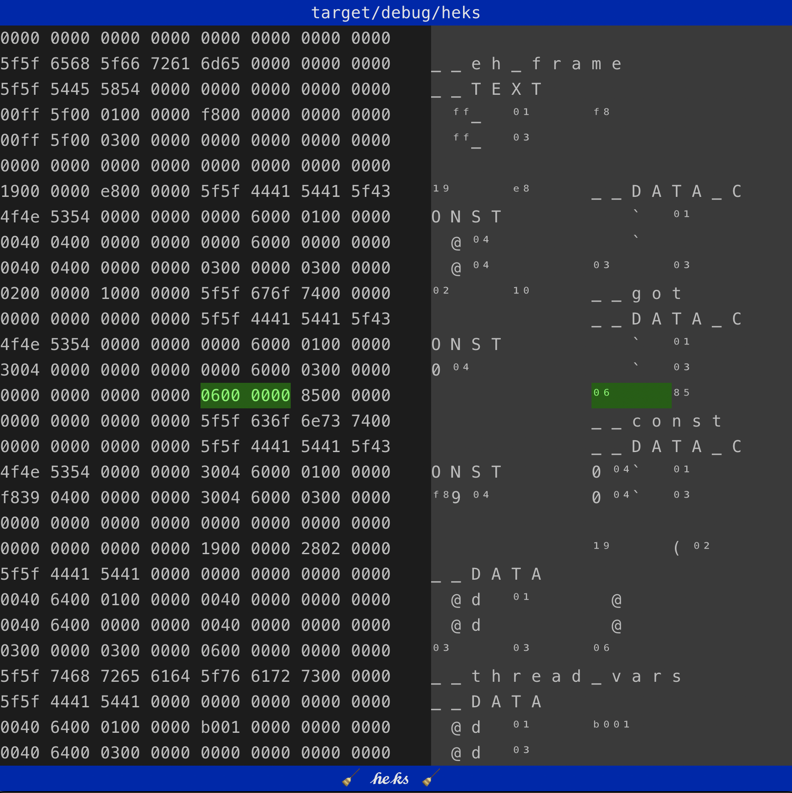

# 🧹 𝒽𝑒𝓀𝓈 🧹
# a hex viewer for your terminal

𝒽𝑒𝓀𝓈 is a hex viewer that runs in the terminal.

## Status

𝒽𝑒𝓀𝓈 is currently under development. It supports basic loading and display
of files, but not much more. It's probably full of [bugs](https://github.com/sdutoit/heks/issues).

## Goals

𝒽𝑒𝓀𝓈 runs in the terminal, so you can run it wherever the files are you are
trying to inspect.

Beyond that, 𝒽𝑒𝓀𝓈 aims to:

- [x] Display arbitrarily large files that can be memory-mapped
- [x] Columnar hexadecimal display similar to `xxd`
- [x] Display hex representations of non-printable characters using unicode
  characters
- [x] Scroll simply and intuitively with `⇦`, `⇨`, `⇧`, `⇩` as well as vi-like
  `🄷`, `🄻`, `🄹`, `🄺` keys
- [x] Allow the cursor to be shrunk or grown with `⇧`+`🄷` (shift+H) and
      `⇧`+`🄻` (shift+L) respectively.
- [x] Jump around with `⇞` (page up) and `⇟` (page down) as well as `⇱` (home)
  and `⇲` (end)
- [x] Provide a stack of locations to jump back through
- [ ] Interpret groups of bytes as (big/little endian) integers
- [ ] Highlight consecutive ASCII strings
- [ ] Mark up sections of the file with names and type information
- [ ] Store and retrieve bookmarks
- [ ] Filter sections through external tools
- [ ] Display streams/files that can't be memory mapped

# License

𝒽𝑒𝓀𝓈 is available under the [MIT license](LICENSE).
